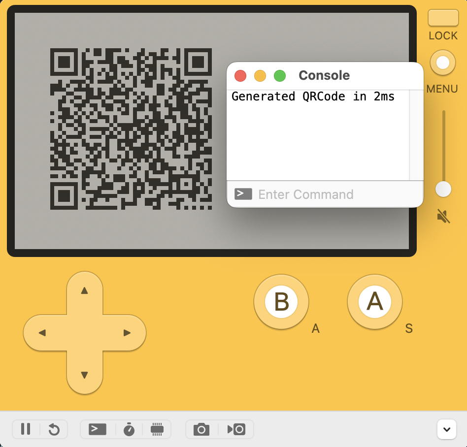

# crunk-qrcode:

> QRCode for Playdate (C accelerated)

This library is part of the Crunk Playdate project: [notpeter/crunk](http://github.com/notpeter/crunk).

It provides Lua API for Playdate Games to rapidly generate QRCode images.

## Why?

The QRCode library [included in the PlaydateSDK](https://github.com/notpeter/playdate-luaqrcode)
is a fork [speedata/luaqrcode](https://github.com/speedata/luaqrcode) and
is written in Pure Lua.
The Lua QRCode implementation is so slow that Panic had to
[patch qrencode.lua](https://github.com/notpeter/playdate-luaqrcode/commit/ecfb836fe7718773c4c5aa2633511b69d228ad97)
with `coroutine.yield()` and create a wrapper with callbacks so
it could be used async so your game didn't hang for a few seconds
whenever you needed a QRCode.

In practice this meant that most QRCodes took more than a second to
generate. For example "https://play.date/" is 16 characters and took 1050ms.

The C implementation is faster. Much faster:

Length | Lua     | C     |   Speedup
------ | --------| ------| ---------
16     | 1050ms  | 7ms   | 150x
100    | 2267ms  | 21ms  | 100x
254    | 3934ms  | 46ms  | 85x
1323   | 16114ms | 214ms | 75x

## Example

```
cd crunk/qrcode
make
open qrcode.pdx
```



See [Source/main.lua](Source/main.lua) for how this works.

## Usage

1. Copy the `Makefile` and `src` directory into your Lua Playdate Project.
2. Generate a image with a QRcode:

```lua
local image = crunk.qrcode.generate("https://panic.com")`
image:drawScaled(20, 20, 4, 4)
```

3. See [`library/stub.lua`](https://github/notpeter/crunk/library/stub.lua)
for documentation of all optional function parameters.

## Giving Thanks

If you find this software useful, please consider:

1. [Sponsoring me on GitHub](https://github.com/sponsors/notpeter/)
2. [Purchasing something from my Itch Store](https://notpeter.itch.io)
3. Sending me free copies of your Playdate apps using Crunk.

## License

```
MIT License

Copyright (c) 2023 Peter Tripp
Copyright (c) Project Nayuki

Permission is hereby granted, free of charge, to any person obtaining a copy
of this software and associated documentation files (the "Software"), to deal
in the Software without restriction, including without limitation the rights
to use, copy, modify, merge, publish, distribute, sublicense, and/or sell
copies of the Software, and to permit persons to whom the Software is
furnished to do so, subject to the following conditions:

The above copyright notice and this permission notice shall be included in all
copies or substantial portions of the Software.

THE SOFTWARE IS PROVIDED "AS IS", WITHOUT WARRANTY OF ANY KIND, EXPRESS OR
IMPLIED, INCLUDING BUT NOT LIMITED TO THE WARRANTIES OF MERCHANTABILITY,
FITNESS FOR A PARTICULAR PURPOSE AND NONINFRINGEMENT. IN NO EVENT SHALL THE
AUTHORS OR COPYRIGHT HOLDERS BE LIABLE FOR ANY CLAIM, DAMAGES OR OTHER
LIABILITY, WHETHER IN AN ACTION OF CONTRACT, TORT OR OTHERWISE, ARISING FROM,
OUT OF OR IN CONNECTION WITH THE SOFTWARE OR THE USE OR OTHER DEALINGS IN THE
SOFTWARE.
```

## 3rd Party Components

### [nayuki/QR-Code-generator/c](https://github.com/nayuki/QR-Code-generator/tree/master/c)
- files: [qrcodegen.c](qrcodegen.c), [qrcodegen.h](qrcodegen.h)
- author: [Project Nayuki](https://github.com/nayuki)
- license: MIT
- updated: 2022-02-02
- commit: [c147f7e328d1e5bdcf5aac76c7d7b90516c1058d](https://github.com/nayuki/QR-Code-generator/tree/c147f7e328d1e5bdcf5aac76c7d7b90516c1058d)
- changes: Add `#define assert` no-op.

### [C macros for working with Playdate bitmap data](https://devforum.play.date/t/c-macros-for-working-with-playdate-bitmap-data/7706)
- files: [crunk_qrcode.h](src/crunk_qrcode.h) `setpixel` macro
- author: [Dustin Mierau](https://github.com/mierau)
- license: unknown
- updated: 2022-07-22
